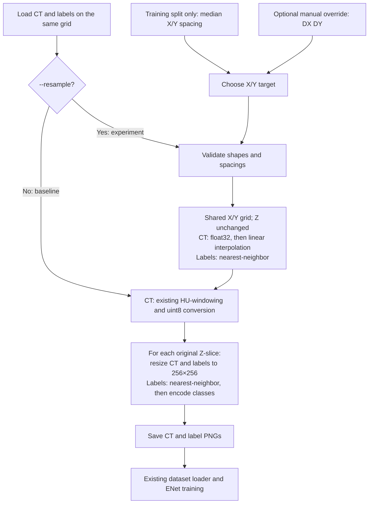

# Introduction

This document describes the changes made on the `feature/simple-resampling` branch. It is organized by commit to document what changed, why each change was introduced, and how it was verified.

The goal of this branch is to improve the existing optional voxel-resampling step while keeping the rest of the preprocessing pipeline unchanged as much as possible. Resampling is limited to the X/Y dimensions; the Z dimension is preserved. The existing HU-windowing and full-slice resize to 256×256 are intentionally retained.

The later full-slice resize to 256×256 can reduce some of the physical scale standardization introduced by resampling. This is an accepted limitation of this experiment.

## Simplified pipeline overview



Target selection runs only with resampling enabled; a manual override replaces the training-set median. Labels bypass CT windowing. Original source spacings are saved separately in `spacing.pkl`.

## Commit 1: Baseline regression tests

The first three tests record the baseline: HU-windowing, 256×256 output, slice count and naming, label encoding, and original spacing metadata. Default calls and explicit `resample=False` must match the same pixel expectations.

All **3 tests passed**, establishing the reference for later changes.

## Commit 2: Derive and validate X/Y target spacing

With `--resample`, the target is now the median spacing per X/Y axis of the training split. Validation and test data do not contribute. Empty training sets and non-finite or non-positive source spacings are rejected.

`--target_spacing DX DY` remains available as a validated manual override. It now accepts two values instead of three. The log identifies whether the target comes from the training-set median or a manual override. The normal experiment uses the training-set median.

Each patient’s original Z spacing is passed to the existing resampling function as its Z target, keeping the Z zoom factor at 1. Without `--resample`, target-spacing calculation is skipped and the baseline path is retained. Interpolation improvements are reserved for the next step.

Seven tests were added for target selection and validation. All **10 tests passed**, including the baseline tests.

## Commit 3: Align CT and label resampling in X/Y

This step updates `resample_voxels`. Before interpolation, it checks that CT and labels are both 3D, have identical shapes, and contain no empty spatial dimensions. Source spacings and the two-value X/Y target are validated as finite and positive.

### Shared geometry and Z preservation

Both arrays use the same zoom factors:

```python
zoom_factors = (dx / target_dx, dy / target_dy, 1.0)
```

A smaller target spacing increases the number of samples along that axis; a larger target spacing reduces it. Identical input shapes, zoom factors, and coordinate settings place CT and labels on the same output grid. The Z factor is fixed at 1, preserving the original slice count and order without interpolation between slices. X/Y values within each slice can still change.

`slice_patient` now passes the X/Y target directly. This replaces step 2’s temporary approach of appending each patient’s Z spacing to the target. The slice loop continues to use the original Z count, and `spacing.pkl` retains its original source-spacing meaning.

### Interpolation settings

- **CT:** conversion to `float32` happens before `zoom`, followed by linear interpolation (`order=1`). Previously, interpolating an integer CT array produced integer output, losing fractional interpolated values. The conversion preserves those values until the existing HU-windowing and uint8 conversion.
- **Labels:** nearest-neighbor interpolation (`order=0`) selects existing class values instead of blending them. The label dtype is preserved.
- **Coordinates and boundaries:** both calls explicitly use `grid_mode=False`, retaining the existing voxel-center coordinate convention, and `mode="constant"` with zero fill outside the input. These settings are shared so the interpolation methods sample the same geometry.
- **Prefiltering:** `prefilter=False` is explicit because interpolation orders 0 and 1 do not require a spline prefilter.

Resampling remains before the existing HU-windowing and slice resize.

Six tests were added for interpolation, geometry, Z preservation, and invalid inputs. All **16 tests passed**.

## Commit 4: Verify optional resampling pipeline integration

Three integration tests check actual PNG output with resampling on/off and CLI argument handling. Input loading is mocked; resampling, windowing, resize, and PNG I/O run normally on a synthetic 512×512×135 volume. Independent pixel expectations also check that resampling precedes windowing.

All **19 tests passed**. No production-code changes were needed in this step.

### Running the comparison

Run from the project directory, replacing the source path with the dataset location. Destination directories must not already exist. Keep the seed, fold, and validation count identical for both runs.

```bash
# Baseline
ai4mi/bin/python slice_segthor.py --source_dir /path/to/dataset --dest_dir data/baseline_xy --shape 256 256 --retains 5 --seed 0 --fold 0

# Experiment: target derived from the training split
ai4mi/bin/python slice_segthor.py --source_dir /path/to/dataset --dest_dir data/resampled_xy --shape 256 256 --retains 5 --seed 0 --fold 0 --resample
```

For a manual target, append `--target_spacing 1.0 1.0` to the experiment command. Both outputs feed the existing ENet pipeline.

Run all preprocessing tests with:

```bash
ai4mi/bin/python -m unittest discover -s tests -p 'test_simple_resampling.py' -v
```

### Real-data smoke test on Snellius

`tests/smoke_simple_resampling.py` was run successfully on Snellius using three patients: two for training and one for validation. The script used training-derived X/Y spacing with resampling enabled and did not modify the original data.

It verified the generated PNG sizes, dtypes, label values, slice counts, stored spacings, logged target spacing, and successfully loaded batches from both train and validation splits using the existing dataset pipeline.

The run completed with `PASS`. Outputs and `preprocessing.log` were retained for inspection. No ENet training was performed.

## Implementation reference: changes in `slice_segthor.py`

The interpolation settings are explained under commit 3. This table summarizes each affected function and its purpose.

| Function | Adjustment | Purpose |
| --- | --- | --- |
| `validate_spacing` | New helper checking axis count and finite, positive values. | Apply consistent validation to source spacings and targets. |
| `compute_median_spacing` | Reject empty input, validate source spacings, return only X/Y medians. | Define an in-plane target without changing Z. |
| `main` | Use training IDs for the default target, or validate a manual override; log its source and share it across training/validation. Skip target selection when disabled. | Prevent leakage and inconsistent targets while keeping resampling optional. |
| `get_args` | Accept `--target_spacing DX DY` instead of three values; update help. | Match the X/Y-only contract and reject obsolete Z targets. |
| `slice_patient` | Require and validate the target only when enabled; pass the X/Y pair directly and retain the original slice count. | Integrate the revised helper into the existing slicing route. |
| `resample_voxels` | Validate matching non-empty 3D shapes and spacings; use shared X/Y geometry, fixed Z, and float32 CT. | Preserve CT/label alignment and fractional intensities. Shape checks assume inputs are already aligned; they do not perform registration. |

Existing HU clipping to [-400, 400], uint8 conversion, full resize to 256×256, and label encoding (0, 63, 126, 189, 252) remain unchanged. Loading, dataset checks, splits, and ENet training are also retained. `spacing.pkl` continues to store source spacings, not the effective spacing of the final PNGs.

## Test reference: what each test checks and why

All **19 methods passed** in `tests/test_simple_resampling.py`. Several use subcases to check different axes or invalid values. The groups cover separate failure modes: baseline regressions, target selection, numerical resampling, and integration.

Image expectations are independent of production helpers. Input loading is mocked; the final PNG integration test uses real disk I/O.

### Baseline reference — 3 tests

| Test | What it checks | Why it matters |
| --- | --- | --- |
| `test_hu_windowing` | Known HU values below, inside, and above [-400, 400] produce the expected uint8 intensities. | Detects changes to clipping, scaling, or integer conversion. |
| `test_slice_patient_baseline` | Default and explicit `resample=False` calls produce the expected 256×256 image/label arrays, 135 slice pairs, names, and returned spacings. Resampling must not be called. PNG writing is mocked. | Establishes a pixel-level reference for the original route and checks that resampling stays optional. |
| `test_main_preserves_original_spacing_metadata` | `main` writes and reloads a real temporary `spacing.pkl` containing the original spacings returned for training and validation patients, without computing a target. Patient slicing is mocked. | Protects the meaning of spacing metadata and the baseline control flow. |

### Target selection and validation — 7 tests

| Test | What it checks | Why it matters |
| --- | --- | --- |
| `test_validate_spacing_accepts_positive_finite_values` | A valid X/Y pair is accepted and returned with the expected values. | Ensures validation permits ordinary inputs. |
| `test_validate_spacing_rejects_invalid_values_on_every_axis` | Zero, negative values, NaN, and both infinities are rejected on every axis of two- and three-value spacings. | Prevents invalid values from entering spacing calculations. |
| `test_validate_spacing_rejects_wrong_dimensions` | Empty, short, three-value, and nested inputs are rejected when a two-value target is required. | Makes the X/Y target contract explicit. |
| `test_median_spacing_rejects_empty_training_set` | An empty training list raises an error without reading any headers. | Prevents an undefined median from becoming the target. |
| `test_median_spacing_rejects_invalid_source_spacing` | Invalid values on any source axis are rejected during target estimation, with the patient identified in the error. | Ensures the estimator actually validates its inputs, including source Z even though only X/Y contribute to the median. |
| `test_main_uses_training_xy_median_or_manual_override` | Distinct X/Y medians come only from training headers; training and validation receive the same target. An override skips median calculation. Logs identify the target and its source. | Detects data leakage, swapped axes, inconsistent split targets, or an ignored override. |
| `test_main_rejects_invalid_override_before_processing` | Invalid manual targets raise an error before slicing, target estimation, or output-directory creation. | Avoids starting a preprocessing run with an unusable override. |

### Resampling mathematics — 6 tests

| Test | What it checks | Why it matters |
| --- | --- | --- |
| `test_linear_ct_preserves_fractional_values` | An integer CT ramp produces the independently expected fractional values and float32 output after enlargement. | Catches integer rounding during interpolation or use of the wrong interpolation order. |
| `test_ct_and_labels_share_xy_coordinates` | A coordinate pattern is enlarged along X and reduced along Y. CT and labels match their expected samples on the same output grid; labels retain their dtype and contain no new class values. | Detects axis swaps, coordinate shifts, mismatched geometry, or blended labels. |
| `test_z_slices_remain_separate_and_in_order` | Three slices with different constant intensities and labels remain separate and ordered for several source Z spacings. | Detects accidental Z resampling or mixing between slices. |
| `test_identity_spacing_preserves_values_and_inputs` | Equal source and target X/Y spacings preserve image and label values, return float32 CT, and leave the input arrays unchanged. | Checks the identity case and guards against modifying the caller’s arrays. |
| `test_rejects_invalid_array_shapes` | Non-3D, mismatched, and empty arrays raise errors. | Prevents resampling incompatible CT/label volumes. |
| `test_rejects_invalid_source_and_target_spacings` | Direct calls to `resample_voxels` reject invalid source/target values and incorrect spacing lengths. | Confirms that the resampling function remains guarded when called outside `main`. |

### Pipeline and command-line integration — 3 tests

| Test | What it checks | Why it matters |
| --- | --- | --- |
| `test_saved_pngs_with_resampling_on_and_off` | Both routes process a synthetic volume and write/read every CT and label PNG. Pixels, dimensions, dtype, filenames, slice count, label encoding, and returned source spacing match independent expectations. | Checks that the processing stages work together and that resampling occurs before HU-windowing. Unlike the earlier baseline test, PNG writing is real. |
| `test_cli_defaults_and_resampling_options` | Parsing defaults disables resampling and uses 256×256; `--resample` enables it; a two-value override is parsed correctly. | Checks that users can select the intended routes through the CLI. |
| `test_cli_rejects_old_three_value_target` | A three-value target exits with an argument error. | Prevents an obsolete Z target from being silently accepted. |

These results cover the synthetic cases above. They do not validate real NIfTI/NRRD decoding, every possible input geometry, multiprocessing, or segmentation accuracy after training.
